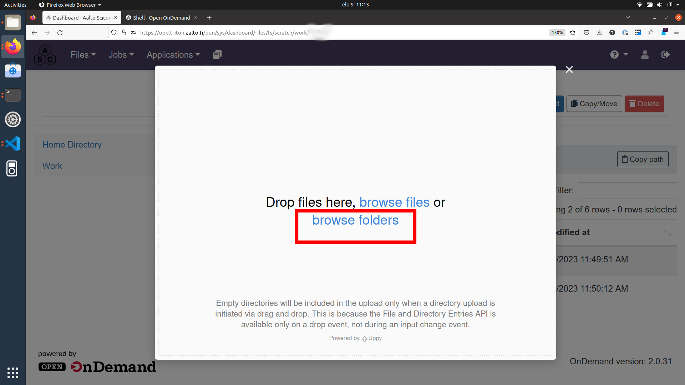
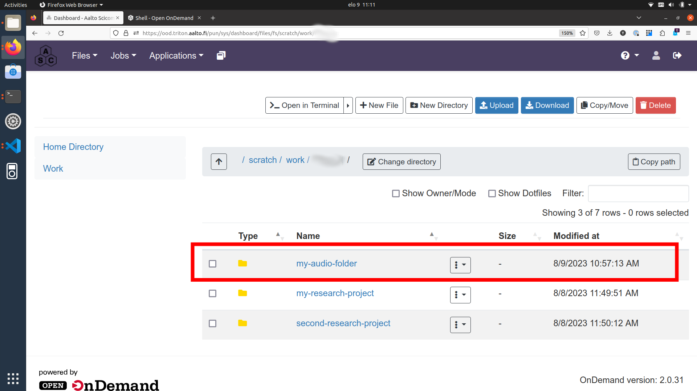
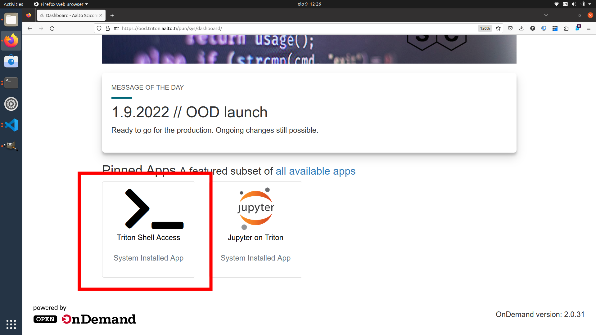
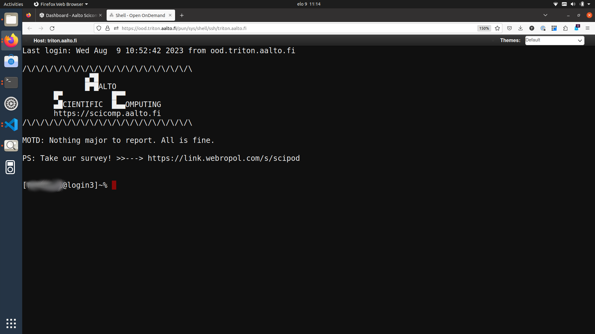

# User Guide

Aalto speech2text app is available to researchers of Aalto University. The app is run on the [Aalto Triton cluster](https://scicomp.aalto.fi/triton/) and its usage is free for all Aalto researchers (master's thesis workers, doctoral students, post docs, visiting researchers). The list of supported languages can be found [here](https://github.com/openai/whisper#available-models-and-languages).

>**_IMPORTANT:_** If you use speech2text in your research, [remember to acknowledge Triton and the Aalto Science-IT project in your publication](https://scicomp.aalto.fi/triton/acknowledgingtriton/).

In order to transcribe your speech files into text, apply the following steps (detailed instructions below):

1. Create a Triton cluster account (only done once)

2. Copy your audio and/or video files to Triton workspace

3. Run speech2text app

4. Process your result files on Triton or copy them to your personal computer

5. Delete the audio and/or result files from Triton when not needed anymore

The workflow described here is suitable for processing sensitive and personal data.
All data uploaded to and processed on Triton are stored on servers managed by Aalto and can only be accessed from within Aalto network. The files and folders on Triton are protected by standard Unix permissions so that only their owner (you) has access to them.

>**_IMPORTANT:_** **If at any point something doesn't work or you are unsure how to proceed, do not hesitate to contact [the Aalto RSEs](https://scicomp.aalto.fi/rse/). You can visit us at [the daily Zoom help session at 13.00-14.00](https://scicomp.aalto.fi/help/garage/#id1) where we can e.g. create a Triton account for you, walk through the speech2text workflow together, answer questions, help with data analysis, and more.**
>
>You can also check the list of [known issues and troubleshooting](#known-issues-and-troubleshooting).


## Create a Triton account

Triton is the Aalto high-performance computing cluster where we will run the speech2text app. Access is free for Aalto researchers.

If you don't already have a Triton account, please, visit the [account page](https://scicomp.aalto.fi/triton/accounts/) and proceed to fill the account request form. 

> **_NOTE:_** Activating the account takes on average 1-2 work days. However, if you are in a hurry, visit us at [the daily Zoom help session at 13.00-14.00](https://scicomp.aalto.fi/help/garage/#id1) and we can speed up the process.

## Copy your data to Triton

If you are not familiar with Triton usage, we recommend connecting and transferring data to Triton using the web browser interface [Open On Demand](http://ood.triton.aalto.fi). 

> **_NOTE:_**  If you are familiar with Triton usage, feel free to use any of the available approaches [to connect to Triton](https://scicomp.aalto.fi/triton/ref/#connecting) and [to transfer you data](https://scicomp.aalto.fi/triton/tut/remotedata/) and skip directly to next section.

Go to [Open On Demand](http://ood.triton.aalto.fi) and log in with your Aalto username and password. (You will be granted access since your Aalto account has been synced with your Triton account.)

> **_IMPORTANT:_** To connect to Open On Demand, you need to be inside Aalto network or use the Aalto VPN.

On the Open On Demand frontpage, click the `Files` dropdown menu from the left upper corner and select the `Work /scratch/work/your-username`.


On the `Files` page, you can see the existing contents (files and folders) of your workspace on Triton.

Click on the `Upload` button in the right upper corner.


In the following pop-up window, select `browse folders`.



In the following file browser, you will able to select the folder on your computer with the audio/video files. (Here, the folder we are uploading is called `my-audio-folder`.)

A few things to note to make processing easier:

- While not strictly necessary, it is a good practice to put the audio files in a folder even if you only have one. This will keep your workspace organized on both Triton and your own computer.

- The audio files can be of any commonly used audio format, e.g. `.wav`, `.aiff`, `.mp3`, `.m4a`, `.aac`, `.ogg`
  
- The files can also be of any commonly used video format, e.g. `.mp4`, `.mov`, `.avi`

- Make sure your folder and file names do **not** contain white spaces or special characters apart from dash, underscore, and period, that is, use `my-audio-folder` and `my_audio_file.mp3` instead of `my audio folder` and `my"audio"file!.mp3`, respectively.

- It is recommended to divide files into folders according to language, that is, put English interview files in folder `my-english-interviews`, French interviews to `my-french-interviews`, and so forth.

If your browser asks for confirmation, (`Are you sure you want to upload all files from “my-audio-folder”? Only do this if you trust the site.`), you can answer "yes".

Depending on the size of your audio files and the quality of your internet connection, the transfer can take a short or a long time (from a few seconds to several hours). Remember that video files are in general much bigger than audio files.

After the transfer is done, you should see your folder in the list of existing content on the `Files` page.



> **_IMPORTANT:_** Some people have been experiencing difficulties with the Open On Demand file upload. If you receive a "File Upload" error several times in a row, you can try the [SMB remote mounting method](https://scicomp.aalto.fi/triton/tut/remotedata/#remote-mounting-using-smb) or visit us at [the daily Zoom help session at 13.00-14.00](https://scicomp.aalto.fi/help/garage/#id1) and we can figure it out.


## Run speech2text on Triton

Go back to the Open On Demand frontpage by clicking the ASC logo in the utmost upper left corner.

On the front page, click on the Triton Shell Access button.



This will open a command line shell on Triton into a new tab.

> **_NOTE:_** You may get prompted for a password. This is your Aalto password. Note that your key presses do not show - just write your password and press enter.

> **_NOTE:_** If you are using Triton for the first time, you will encounter a question `Are you sure you want to continue connecting (yes/no)?`. You can answer `yes`. You will also likely get a notification that a pair of SSH keys have been created for you.

The command line shell looks roughly like the one below.



On the command line, write (or copy and paste) the following commands. 

First, load the speech2text app with

```bash
module load speech2text
```

This needs to be done only once in this terminal session. The session ends when you close your terminal tab. However, running it multiple times does not hurt.

Next, replace `my.name@aalto.fi` and `mylanguage` with your email address and the language of the audio files you are about to submit for processing, respectively, as follows:

```bash
export SPEECH2TEXT_EMAIL=my.name@aalto.fi
```

```bash
export SPEECH2TEXT_LANGUAGE=mylanguage
```

For example:

```bash
export SPEECH2TEXT_EMAIL=john.smith@aalto.fi
```

```bash
export SPEECH2TEXT_LANGUAGE=finnish
```

>**_IMPORTANT:_** Copy the commands verbatim, that is, make sure the UPPER CASE characters are upper case, lower case characters are lower case, and there are no typos.

These commands sets environment variables for

- the email address where to send notifications of started and completed submissions (recommended)

- the language of the audio files (recommended)

These variables are valid until the end of current terminal session.

>**_NOTE:_** If you don't want email notifications about the jobs, simply unset the email variable with
>```bash
>unset SPEECH2TEXT_EMAIL
>```
> This is equal to not running the `export EMAIL=my.name@aalto.fi command` command in the first place. However, receiving the notifications is recommended.

Finally, submit all the audio files in your folder to the Triton job queue (remember to replace `my-audio-folder` with the name of the folder you just uploaded) with
```
speech2text $WRKDIR/my-audio-folder
```

The command outputs information about the submission, for example:

```bash
Submit speech2text jobs with arguments:
	INPUT: my-audio-files
	SPEECH2TEXT_TMP: /home/smithj1/.speech2text
	SPEECH2TEXT_MEM: 12G
	SPEECH2TEXT_CPUS_PER_TASK: 6
	SPEECH2TEXT_TIME: 24:00:00
	SPEECH2TEXT_EMAIL: john.smith@aalto.fi
	SPEECH2TEXT_LANGUAGE: finnish
Given language 'finnish' is supported.
Email notifications will be sent to: john.smith@aalto.fi
Input directory: /scratch/work/smithj1/my-audio-folder
Scan input audio files from: /scratch/work/smithj1/my-audio-folder
/scratch/work/smithj1/my-audio-folder/test1.mp3: Submit
/scratch/work/smithj1/my-audio-folder/test2.mp3: Submit
Submitted batch job 24238902
```

>**_IMPORTANT:_** If you made a mistake while submitting, e.g., specified wrong folder, file, or language, you can cancel the submitted job simply with 
>```
>scancel JOBID
>```
> where the JOBID is printed at the last line of the submission message. (In the above example message, JOBID is 24238902).


Alternatively, you can submit a single file instead of a folder simply by replacing the folder name with the file name
```bash
speech2text $WRKDIR/my-audio-folder/test1.mp3
```

The speech2text job(s) are now in the queue. You will receive email notifications when the jobs have begun and have completed.

Optionally, you can also monitor the job states using the following command
```
slurm queue
```
which tells you for each job ID if the job is still in the queue waiting for resources (_PENDING_) or already running (_RUNNING_).

>**_NOTE:_** As a rule of thumb, the results will be ready at the next day latest. However, if you receive an email saying the processing has failed or have not received any emails within, say, an hour of running the speech2text command, something has gone wrong. In this case, visit RSEs at [the daily Zoom help session at 13.00-14.00](https://scicomp.aalto.fi/help/garage/#id1) and we will figure it out.

If you have no more work to submit at this time, you are free to close the terminal window and log out from Open On Demand. If the browser asks for confirmation (`This page is asking you to confirm that you want to leave — information you’ve entered may not be saved.`), you can answer "yes".

However, if you wish to submit more audio folders or files for processing, you are free to do so in this same session. In this case, note that

- If you want to change audio language, simply set the language variable again with
  
  `export SPEECH2TEXT_LANGUAGE=anotherlanguage`
  
  Otherwise the next audio files will be submitted with the previously specified language.

- If you want to change the email address for notifications, simply set the email variable again with

  `export SPEECH2TEXT_LANGUAGE=jane.smith@aalto.fi`

  Otherwise the next notifications will be sent to the previously specified email address.
    
- You don't need to load the speech2text module again in this session. However, running `module load speech2text` multiple times does not hurt.


## Inspect and copy result files to your personal computer

After receiving an email saying an audio file has finished processing, log back into [Open On Demand](http://ood.triton.aalto.fi).

At the Open On Demand frontpage, select again the `Files` and `Work` page (upper left corner). Enter your audio folder. You should now see the newly created `results` folder.

Enter the `results` folder and notice there are two result files corresponding to each audio file:

- `.csv` files: e.g. `test.csv`

- `.txt` files: e.g. `test.txt`

Example of `.csv` output format (computer-friendly):
```
start,end,speaker,transcription
00:00:00,00:00:05,SPEAKER_00,"This is the first sentence of the first speaker."
00:00:06,00:00:10,SPEAKER_00,"This is the second sentence of the first speaker."
00:00:11,00:00:15,SPEAKER_01,"This is a sentence from the second speaker."
00:00:16,00:00:20,SPEAKER_00,"This is the first speaker speaking again."
```

Corresponding example of `.txt` output format (human-friendly):
```
(00:00:00 - 00:00:10) SPEAKER_00

This is the first sentence of the first speaker. This is the second sentence of the first speaker.

(00:00:11 - 00:00:15) SPEAKER_01

This is a sentence from the second speaker.

(00:00:16 - 00:00:20) SPEAKER_00

This is the first speaker speaking again.
```

The `.txt` files have basic text format and can be opened in a text editor (e.g. Microsoft Word, Google Docs). The `.csv` files have comma separated table format which is easy to read by computers and can be opened in a spreadsheet software (e.g. Microsoft Excel, Google Sheets).

You can either download individual result files or the whole `results` folder if you want to continue working on them on your personal computer using your preferred software. (Check the dropdown menus next to individual files and folders.)

>**_NOTE:_** The result files for a single audio file are created only **after** the processing of that audio file has been fully completed. In other words, if you can see and access the result files, you are free to move/copy them as the processing has already completed.


## Remove unneeded files and folders from Triton workspace

If you do not need your audio and/or result files and/or folders, you can remove them by selecting `Delete` from the dropdown menus next to individual files and folders.


## Known issues and troubleshooting

**If at any point something doesn't work or you are unsure how to proceed, do not hesitate to contact [the Aalto RSEs](https://scicomp.aalto.fi/rse/). You can visit us at [the daily Zoom help session at 13.00-14.00](https://scicomp.aalto.fi/help/garage/#id1) where we can walk through the speech2text workflow together, debug problems, answer questions, help with data analysis, and more.**

### My transcription has a weird segment where a word or two are repeated over and over.

This is a quite known issue with the OpenAI Whisper speech recognition model. This behavior is sometimes triggered 
by bad audio quality during that segment (background noise, mic issues, people talking over each other). However, sometimes this seems to happen even with good audio quality. Unfortunately, there is nothing we can do about this at the moment: you have to go through that particular audio segment and transcribe it manually.

### My speech2text process ran over night and I got noted that the job failed due to time limit.

The run time of speech2text on a single audio file is limited to 24 hours by default. If you have very large audio files (several hours), you can try setting the maximum run time to a larger value, e.g. 72 hours, with 
```
export SPEECH2TEXT_TIME=72:00:00
```
Run the speech2text on your file/folder again normally according to the guide [above](#run-speech2text-on-triton). 

### I accidentally closed the browser tab/window when speech2text was still running.

Successfully submitted jobs are running on the Triton Slurm queue so you can log out of Open On Demand, close your the browser tab/window, or shut down your computer while waiting for the results. You will get email notifications when the results are available.

### Why do we use work directory `Work /scratch/work/user-name` instead of `Home Directory`?

 `Home Directory` has a small disk space quota (10Gb) and `scratch/work/` has a large one (200Gb).
 Workspace disk is also faster than the home directory.

### My work directory has a lot of files named slurm-22970577.out, slurm-22235218.out, etc.

They are log files from the Slurm jobs. They can be helpful if something goes wrong with the speech2text jobs. You can either leave them there, move them to a folder, or remove them completely after you have checked that the speech2text results look good.

### I don't want email notifications about the jobs.

Unset your email
```bash
unset EMAIL
```
before running the speech2text command [as usual](#run-speech2text-on-triton).

### What if I don't specify the language?

You can leave the language specification out by unsetting the language environment variable
```bash
unset LANGUAGE
```
before running the speech2text command [as usual](#run-speech2text-on-triton). In this case, speech2text will try to automatically detect the language. Results may vary.

### What if my audio file contains speech in more than one language?

If a single audio file contains speech in more than one language, result files will (probably) still be produced but the results will (probably) be nonsensical to some extent. In some cases, this can be avoided easily. For example, if the language changes at the middle of the audio, just split the file into two parts and process them separately. You can use any available audio software to do this, for example, [Audacity](https://www.audacityteam.org/).

### What happens if I run the speech2text command for audio file(s) that have already been processed and completed?

This is safe to do: speech2text checks if the expected result files already exist and if so, exits early without doing any further processing.


